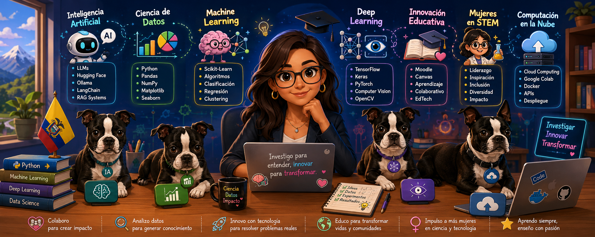

# PhD. Paulina Vizcaíno

  

## 🚀 About Me

🎓 Academic Director – School of Computer Science, UIDE

🤖 Artificial Intelligence Researcher

📊 Data Science & Machine Learning

🎓 Educational Innovation

👩‍🔬 Women in STEM Advocate

🌎 Transforming education through AI and data

## 🛠 Technologies

## 📚 Research Areas

- Artificial Intelligence
- Data Science
- Educational Technology
- Machine Learning
- Deep Learning
- Women in STEM
- Learning Analytics

Academic Director | Artificial Intelligence | Data Science | Educational Innovation

Investigating, innovating and transforming education through Artificial Intelligence, Data Science and Human-Centered Technology.
